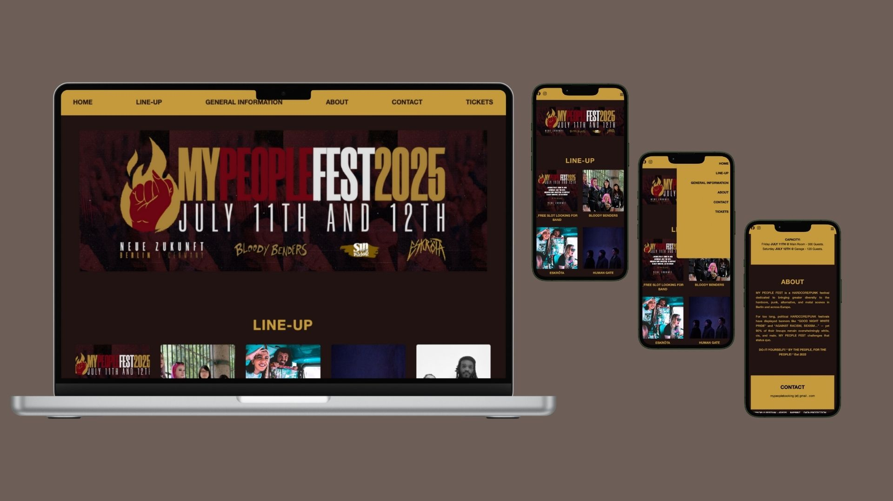

# MY PEOPLE FEST

Welcome to the official codebase of **MY PEOPLE FEST**, a grassroots, DIY hardcore/punk festival created to increase diversity in alternative music scenes in Berlin and across Europe. 
  

## About the Project

This is the **official website** for MY PEOPLE FEST — fully developed with responsiveness in mind, optimized for both desktop and mobile.

The platform provides:
- Full **band line-up** with interactive modals
- Essential **festival information**
- An **accessibility-conscious** layout
- Integrated **socials**, **legal** modals, and **ticket links**

## Core Values

- **DIY Ethos**: Built from the ground up with no corporate backing  
- **Diversity & Inclusion**: Actively platforming BIPoC, LGBTQIA+, and other underrepresented communities in hardcore/punk scenes  
- **Transparency**: Clear imprint and data protection policies provided

---

## 🛠️ Tech Stack

- **Frontend**: React, Vite, Tailwind CSS  
- **Routing**: React Router  
- **Deployment**: Netlify  
- **Design**: Mobile-first, fully responsive  
- **Assets**: Custom artwork & band imagery

---

## Features

- 🎞️ Hero slider (desktop) / custom collage image (mobile)
- 📱 Adaptive layout for all devices
- 🖼️ Band modals with bios, video, and social links
- 🎟️ Ticket integration via Eventbrite
- 🧾 Fully implemented legal modals (Imprint & Data Protection)

---

## Project Structure

src/
├── assets/ # Images and media
├── components/ # Reusable UI (Navbar, Footer, LegalModal, etc.)
├── data/ # Static band roster
├── pages/ # Page-specific layout (Home, Roster, etc.)
└── App.jsx # Main routing component

---

## Live Website

[Visit My People Fest](https://mypeoplefest.net)  

---

## 👩🏾‍💻 Made by

**Lilian Rodrigues**  
Junior Web Developer — Berlin/DE 
[GitHub](https://github.com/Lilian-CR)
---

## License

This project is open-source under the [MIT License](LICENSE)
